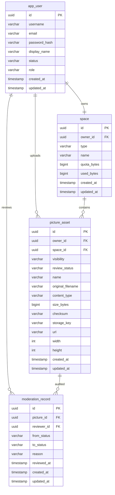

# Initial ER Model

The diagram focuses on P1 functionality: identity, personal space, and picture assets.

## Table Notes
- `app_user.username` and `app_user.email` are unique.
- `app_user.role` uses `USER` or `ADMIN`.
- `space` defaults to a personal space created on registration.
- `picture_asset.review_status` is `PENDING` for public uploads.
- `picture_asset.visibility` supports `PUBLIC`, `PRIVATE`, `TEAM`.
